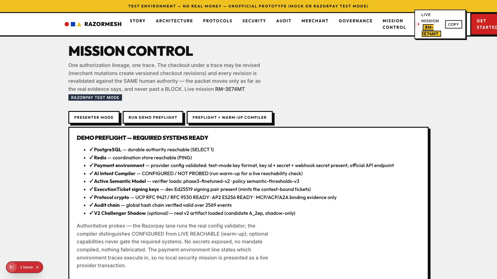
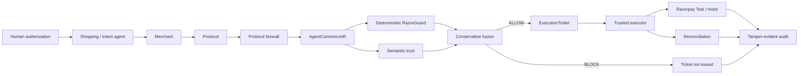
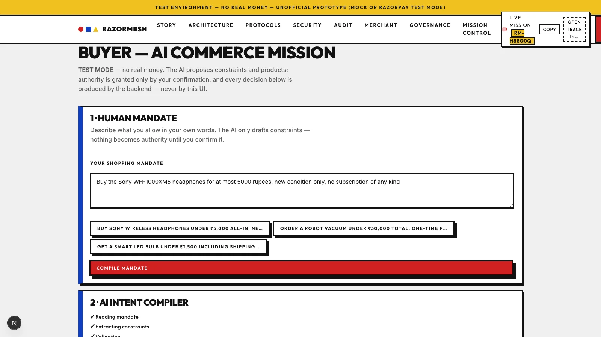
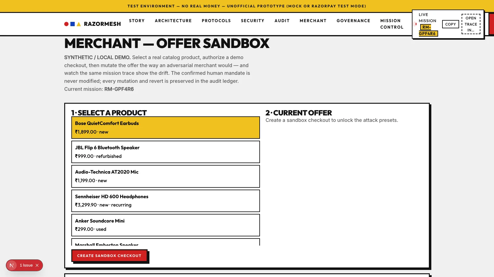
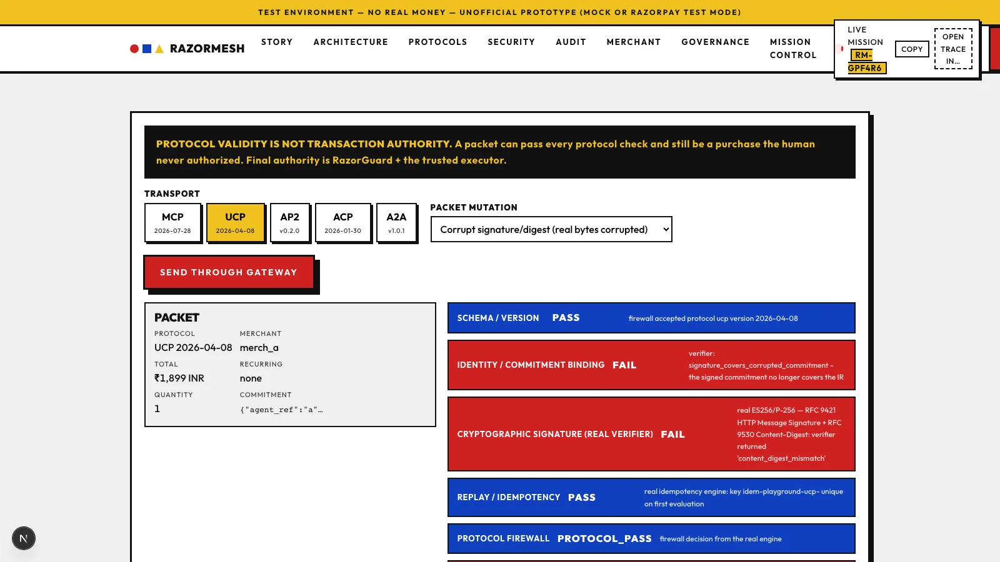
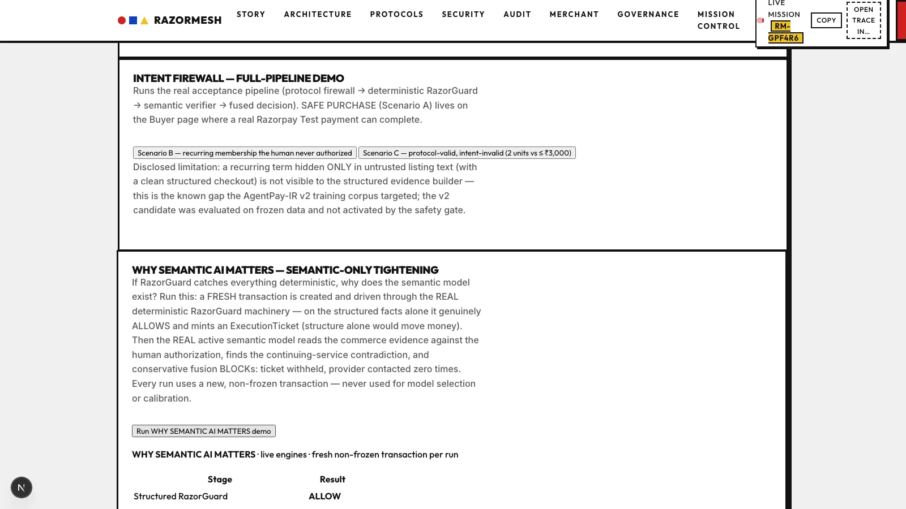
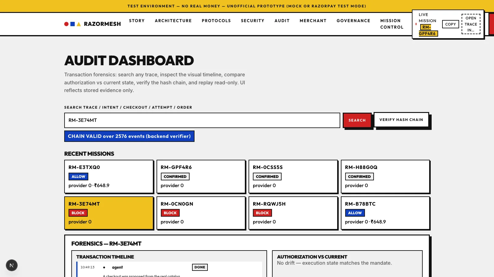
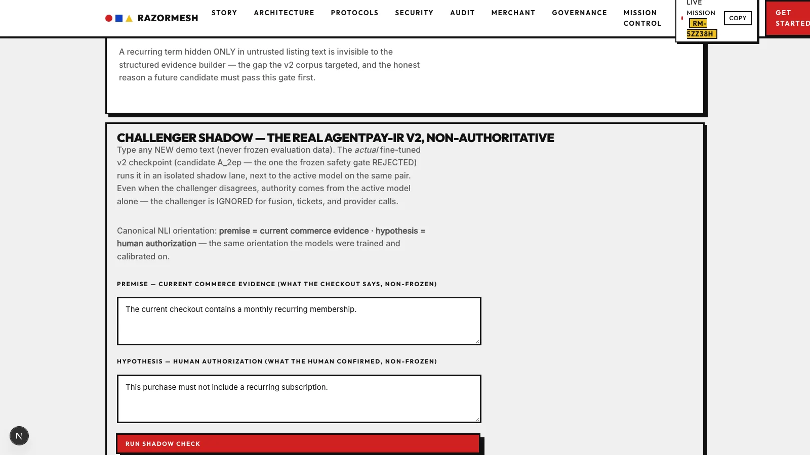

# RazorMesh Trust

**Zero-Trust Authorization Infrastructure for Agentic Commerce**

> **Protocol validity is not transaction authority.**
>
> **The AI proposes. RazorGuard authorizes. The trusted executor executes.**

RazorMesh is a security layer for AI-driven commerce that verifies the exact
current transaction against human-confirmed authority immediately before
execution. It combines protocol verification, a normalized commerce IR,
deterministic policy enforcement, semantic contradiction detection,
context-bound execution tickets, exactly-once execution, and tamper-evident
audit evidence.

`Razorpay Test Mode / local mock` · `No real money` · `Research prototype`

[Architecture](#architecture) · [Security model](#core-security-model) · [Surfaces](#product-surfaces) · [Governance](#model-governance) · [Benchmarks](#agentpay-x-adversarial-benchmark) · [Running locally](#running-locally)

<!-- Add final demo video link here after upload. -->

---

[](docs/assets/readme/01-mission-control.webp)

Mission Control visualizes one authorization lineage across protocol
validation, normalization, authorization, execution, reconciliation, and
audit. When a transaction violates the confirmed mandate, the packet stops at
the exact stage that rejected it — no ticket is issued and the provider is
never contacted.

## Why RazorMesh

An AI shopping agent can submit a transaction that is schema-valid,
authenticated, correctly signed, and replay-safe — and still not what the
human authorized:

```
Human authorizes:        ₹4,799 · quantity 1 · one-time
Transaction later:       same product + recurring ₹499/month membership

Protocol checks:         valid
Human authorization:     violated
Result:                  blocked before execution
```

Protocol authentication establishes that a message is genuine and well
formed; it says nothing about whether the human approved *this* transaction.
RazorMesh closes that gap at the execution boundary: immediately before
money moves, it re-validates the *current* transaction against the durable
human-confirmed authorization — deterministically and semantically — and
only an explicit ALLOW can produce the context-bound ticket the executor
requires.

## Architecture



- Every inbound agent message passes protocol-specific verification
  (signatures, digests, replay and version policy) at the firewall.
- The verified packet is normalized into **AgentCommerceIR**, the canonical
  commerce projection all downstream checks share.
- **Deterministic RazorGuard** evaluates structured constraints; the
  **semantic verifier** reads sanitized commerce evidence against the
  human-confirmed authorization.
- **Conservative fusion** combines both: a semantic BLOCK always tightens;
  nothing can turn a BLOCK into an ALLOW.
- Only a fused ALLOW mints a short-lived, single-use, context-bound
  **ExecutionTicket**; the **trusted executor** is the only component that
  contacts the payment provider, exactly once per transaction. Reconciliation,
  webhook verification, and the hash-chained audit ledger close the loop.

## Core security model

- Protocol evidence is not authority; the firewall consumes adapter
  verification evidence but is not the cryptographic verifier itself.
- AI code can never mint an ExecutionTicket; neither the shopping agent nor
  the semantic model holds payment authority.
- Semantic verification may tighten a decision, never loosen it; a
  deterministic BLOCK cannot become ALLOW.
- Tickets are short-lived, context-bound, and single-use; provider execution
  requires a valid ticket, replay cannot create a second provider effect, and
  provider-unknown outcomes are never blindly retried.
- Merchant mutation never rewrites human authority — every checkout revision
  is revalidated against the same confirmed intent.
- The challenger model can never enter the payment authority path.
- PostgreSQL is the durable authority for authorization, decision, spend, and
  payment state; money is represented in integer minor units; the audit
  ledger is append-oriented and tamper-evident.

Full invariant list: [`SECURITY.md`](SECURITY.md)

## Product surfaces

| Surface | Route | Purpose |
|---|---|---|
| **Buyer** | `/buyer` | Natural-language mandate compilation to structured constraints, human confirmation, catalog search and ranking, checkout proposal. |
| **Mission Control** | `/mission-control` | Live authorization-lineage visualization, current-transaction diff, execution-state inspection, runtime health checks. |
| **Merchant Sandbox** | `/merchant` | Post-authorization offer mutations (price drift, quantity, merchant swap, hidden membership) with drift detection on the same lineage. |
| **Protocol Playground** | `/protocols` | Real packet mutations through the protocol firewall, IR normalization, and cross-protocol consistency, including real signature verification. |
| **Security Lab** | `/security-lab` | Adversarial scenarios with per-stage verdicts and the semantic-verification evidence described below. |
| **Audit Forensics** | `/audit` | Trace lookup, authorization-vs-current diff, read-only timeline replay, global hash-chain verification, tamper simulation. |
| **Model Governance** | `/governance` | Active-vs-challenger model status and the isolated shadow lane for the rejected candidate. |

There is no hosted deployment; run locally with the instructions below.

## Product gallery

<table>
<tr>
<td width="50%"><a href="docs/assets/readme/02-buyer-ai-mission.webp"></a><br><b>Buyer</b> — mandate compilation, constraint extraction, agent search</td>
<td width="50%"><a href="docs/assets/readme/03-merchant-mutation.webp"></a><br><b>Merchant Sandbox</b> — post-authorization mutation and drift diff</td>
</tr>
<tr>
<td width="50%"><a href="docs/assets/readme/04-protocol-playground.webp"></a><br><b>Protocol Playground</b> — real signature verification of mutated packets</td>
<td width="50%"><a href="docs/assets/readme/05-security-semantic-ai.webp"></a><br><b>Security Lab</b> — semantic verification tightening a structured ALLOW</td>
</tr>
<tr>
<td width="50%"><a href="docs/assets/readme/06-audit-forensics.webp"></a><br><b>Audit Forensics</b> — trace anchors and global chain verification</td>
<td width="50%"><a href="docs/assets/readme/07-model-governance.webp"></a><br><b>Model Governance</b> — active runtime and rejected challenger in shadow</td>
</tr>
</table>

## Intent-to-Execution Integrity

The central invariant: **the transaction that reaches execution must still
match the human-confirmed authorization.**

```
authorization
    ↓
checkout proposal
    ↓
merchant / protocol changes
    ↓
revalidation against the same authority
    ↓
ALLOW or BLOCK
```

Every mission is one authorization lineage: one intent, one trace, and
versioned checkout revisions. A merchant mutation does not fork a new
transaction — it creates a new revision under the same intent, and the
executor's revalidation contract evaluates each revision against the immutable
authorization captured at proposal time. This is why drift is caught at the
boundary rather than trusted downstream.

## Deterministic + semantic authorization

Authorization is a two-stage check with deliberately separated roles.

**Deterministic RazorGuard** evaluates structured constraints — amount and
budget ceilings, quantity limits, recurring state, merchant and condition
allowlists, policy rules (expiry, approval thresholds). It is fully
specified, reproducible, and fail-closed on unknown inputs.

**Semantic Trust** checks the sanitized commerce evidence against the
human-confirmed authorization (canonical NLI orientation: premise = commerce
evidence, hypothesis = authorization), catching contradictions no structured
rule encodes — a protection plan that "automatically renews every twelve
months" against a mandate that forbids continuing services.

Conservative fusion combines them: `ALLOW + BLOCK → BLOCK` and
`BLOCK + anything → BLOCK`; semantic verdicts can only tighten.

A structured transaction can be fully rule-compliant while its commerce
evidence contradicts the human authorization. Real-engine evidence from the
repository's semantic-verification scenario:

| Stage | Result |
|---|---|
| Deterministic RazorGuard | **ALLOW** — structured facts carry no violation |
| Semantic trust | **BLOCK** — p(contradiction) 0.9998 |
| Conservative fusion | **BLOCK** |
| ExecutionTicket | **NOT ISSUED** |
| Execution attempt | **NOT CREATED** |
| Provider | **NOT CONTACTED** |

The structured facts were valid, but the commerce evidence contradicted the
human authorization — semantic verification closed the gap before execution
authority existed. Ticket, attempt, and provider-event counts are identical
before and after the run: the semantic BLOCK prevents ticket creation,
literally.

## Protocol security

| Protocol | Cryptographic verification |
|---|---|
| **UCP** | RFC 9421 HTTP Message Signatures + RFC 9530 Content-Digest, ES256/P-256 — signed and verified by this repository's own signer/verifier; tampering the signed body fails the real digest check. |
| **AP2** | ES256 JWS/JWT with checkout-hash binding — tampering a signed claim fails the real signature check. |
| **MCP / ACP / A2A** | Protocol normalization and commitment/binding evidence; equivalent cryptographic signature verification is not implemented and is not claimed. |

The Protocol Firewall consumes adapter verification evidence and protocol
structure; it is a policy gate, not the cryptographic verifier itself.

## Security scenarios

| Scenario | Protocol | Authority | Ticket | Provider calls |
|---|---|---|---|---|
| Hidden recurring membership inserted after authorization | PASS | BLOCK | NOT ISSUED | 0 |
| Protocol-valid, intent-invalid (2 units vs a ≤ ₹3,000 mandate) | PASS | BLOCK | NOT ISSUED | 0 |
| Semantic-only contradiction (structured ALLOW, evidence contradiction) | PASS | BLOCK (fusion) | NOT ISSUED | 0 |
| Ticket replay (expired / immediate reuse) | — | 403 TICKET_EXPIRED / idempotent | — | 0 additional |

## Model governance

The active semantic runtime is **PRE_V2** (`phase3-finetuned-v2`, policy
`semantic-thresholds-v3`). A fine-tuned challenger, **AgentPay-IR v2** (the
actual A_2ep checkpoint), was evaluated exactly once on frozen,
human-gold-anchored data and **rejected by the safety gate**: it improved
normal test macro-F1 but worsened unsafe contradiction→entailment errors on
the security-critical sets.

| Dataset (frozen, one-shot) | PRE_V2 macro-F1 | v2 macro-F1 | Unsafe C→E (PRE_V2 → v2) |
|---|---|---|---|
| Final test | 0.737 | 0.975 | 43 → 13 |
| Human gold | **0.893** | 0.776 | **2 → 7 (worse)** |
| Fresh OOD | 0.822 | 0.918 | **5 → 6 (worse)** |

A model that lets more gold contradictions reach a provider-call PASS must
not ship, whatever its macro-F1. The rejected checkpoint still runs in an
isolated **shadow** lane on new, non-frozen pairs (canonical orientation),
so disagreement with the active model is visible — while remaining
**non-authoritative**: its output never enters fusion, tickets, or provider
decisions. A fresh clone without the size-excluded artifact reports
CHALLENGER_UNAVAILABLE truthfully.

## AgentPay-X adversarial benchmark

A **191-scenario adversarial policy benchmark** (not live provider attacks):

- **100% safe-pass** and **100% attack-block** at the policy gate
- **0 false allows · 0 false blocks · 0 exactly-once violations**
- Strict per-case stage agreement: **156/191**; the other 35 cases carry
  documented detection-stage differences — the safety outcome is identical,
  the recorded blocking stage differs (e.g. consistency layer vs firewall).
- Provider execution and exactly-once behavior are validated by separate
  acceptance tests, not this benchmark.

<details>
<summary><b>Benchmark granularity details</b></summary>

Per-case strict agreement is 156/191: 35 attacks are blocked at a different
detection stage than the benchmark's per-case expectation records (for
example, a malformed-JSONRPC attack is rejected at the consistency layer
rather than the firewall). The headline gate metrics — safe-pass rate,
attack-block rate, zero false allows/blocks — are unaffected. Exactly-once
execution and provider behavior are proven by the separate acceptance suite
in [`docs/submission/RAZORPAY_TEST_ACCEPTANCE.md`](docs/submission/RAZORPAY_TEST_ACCEPTANCE.md).

</details>

## Razorpay Test Mode validation

| Flow | Result | Provider calls |
|---|---|---|
| Safe: authorize → checkout → ALLOW → ticket → executor | Test **order created** | exactly 1 |
| Hidden recurring term | final BLOCK | 0 |
| Protocol-valid / intent-invalid | final BLOCK | 0 |
| Ticket replay | rejected / idempotent | 0 additional |

All provider integration runs in Razorpay **Test Mode** or the local mock —
no real money. The proven boundary is order creation exactly-once plus
every rejection path; in-browser checkout completion remains a manual
sandbox step.

## Audit and forensics

The audit ledger is a single global hash chain over all authorization,
decision, ticket, provider, and reconciliation events. The forensics surface
provides indexed lookup by trace, intent, checkout, execution-attempt, or
provider order id; an authorization-vs-current diff against the immutable
proposal baseline; read-only timeline replay; global chain verification with
per-trace anchor views; and a non-mutating tamper simulation showing where a
forged row would break the chain.

## Technology

| Layer | Technology |
|---|---|
| Backend | Python 3.13 · FastAPI · SQLAlchemy 2 · Alembic |
| Storage | PostgreSQL 18 (durable authority) · Redis 8 (coordination only) |
| Frontend | Next.js 16 · TypeScript 5 · React 19 |
| Semantic trust | PyTorch · Transformers · DeBERTa NLI (fine-tuned, artifact-hash-enforced) |
| Crypto | Ed25519 (tickets) · ES256/P-256 + RFC 9421/9530 (UCP) · ES256 JWS (AP2) |
| Payments | Razorpay Test Mode (or local mock) |
| Testing | pytest · vitest · Playwright · Hypothesis · ruff · mypy |

## Running locally

```bash
docker compose up -d          # PostgreSQL 18 + Redis 8 (loopback-only)
make setup                    # backend deps + dev keys + frontend deps
make dev-api                  # FastAPI on 127.0.0.1:8000
pnpm --dir apps/web dev       # Next.js on :3000
```

Configuration:

- **Razorpay Test Mode** credentials live in `.env` (never committed; see
  `.env.example`). Without credentials, the mock provider runs and the UI
  states so.
- The deterministic and security stack runs **without any LLM credential**.
  Live AI intent compilation requires a backend-only TokenRouter API key;
  if absent, compilation fails closed rather than substituting another model.
- The AgentPay-IR v2 challenger artifact is intentionally not committed
  (size); without it, the governance surface reports CHALLENGER_UNAVAILABLE
  until the verified artifact is placed at the configured path.

## Runtime health checks

Mission Control exposes runtime health checks for PostgreSQL, Redis, payment
configuration (validated against the provider config rules), intent-compiler
reachability, the active semantic model, ExecutionTicket signing keys,
protocol-crypto capability, and audit-chain validity. Required systems and
optional demo capabilities are reported separately — the challenger shadow
lane, for example, is marked optional and never gates payment-safety
readiness.

## Verification

| Suite | Result |
|---|---|
| Backend main suite | **799 passed, exit 0** (live DeBERTa runtime in the loop) |
| Phase-4 acceptance | **203 passed, exit 0** |
| Live-ingress e2e | **13/13, exit 0** (isolated gate) |
| Frontend | vitest **35/35** · `tsc` clean · `eslint` 0 errors · `next build` OK |
| Static / types | ruff clean · mypy clean (116 source files) |
| Security scan | **PASS — 0 blocking findings** (secret scan, pip-audit, pnpm audit) |

<details>
<summary><b>Test execution notes</b></summary>

Suites are run as separate targeted invocations and reported as such —
never as a single green run. The live-ingress suite is the recorded
isolated gate (13/13); in combined full-suite runs, 2–3 of its tests can
flake from cross-test database interference and pass 100% in isolation.
The Playwright reviewer-v2 specs require `RAZORMESH_REVIEWER_ENABLED=1` on
the serving process and fail without it — an environment gate, not a code
defect. The global audit chain remains valid across all runs.

</details>

## Documentation

- [`ARCHITECTURE.md`](ARCHITECTURE.md) — module boundaries and data flow
- [`SECURITY.md`](SECURITY.md) — the full security invariant list
- [`DECISIONS.md`](DECISIONS.md) — append-only engineering decision log
- [`docs/submission/BUILDATHON_FINAL_EVIDENCE.md`](docs/submission/BUILDATHON_FINAL_EVIDENCE.md) — submission evidence pack
- [`docs/submission/RAZORPAY_TEST_ACCEPTANCE.md`](docs/submission/RAZORPAY_TEST_ACCEPTANCE.md) — Razorpay acceptance chains
- [`docs/agentpay_ir_v2/FINAL_FROZEN_EVALUATION.md`](docs/agentpay_ir_v2/FINAL_FROZEN_EVALUATION.md) — one-shot frozen evaluation

<details>
<summary><b>Additional verification evidence</b></summary>

- [`docs/phase5/FINAL_README_VIDEO_LOCK_STATUS.md`](docs/phase5/FINAL_README_VIDEO_LOCK_STATUS.md) — final repository truth-lock evidence
- [`docs/phase5/VIDEO_STORYBOARD.md`](docs/phase5/VIDEO_STORYBOARD.md) — demonstration walkthrough

</details>

## Project status

RazorMesh is an experimental agentic-commerce security prototype, built for
the Razorpay Buildathon. Payment integration uses Razorpay Test Mode or a
local mock environment; no real-money transactions are performed.
